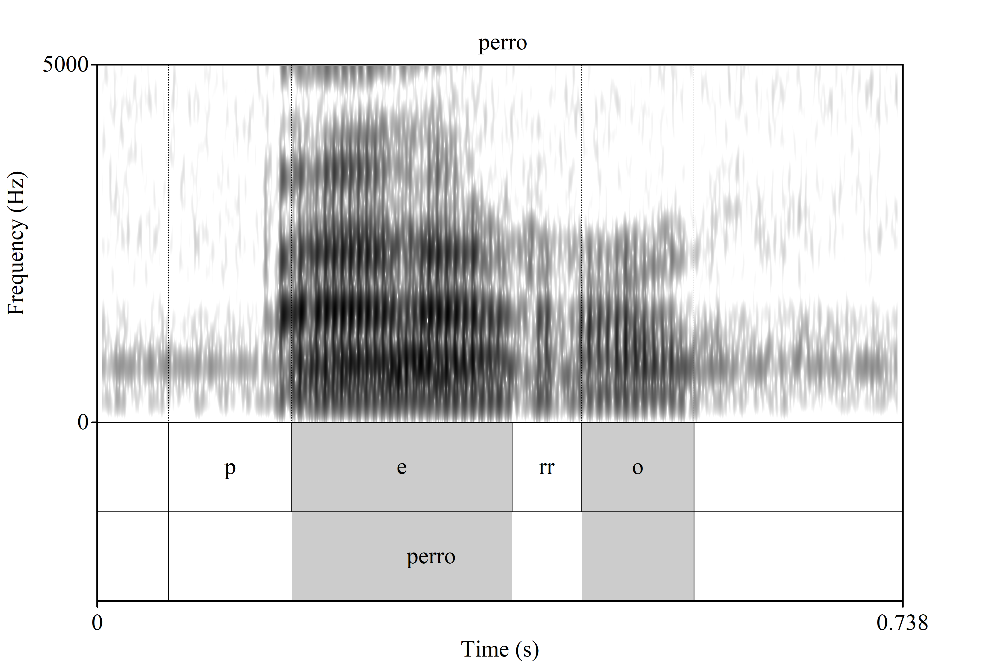
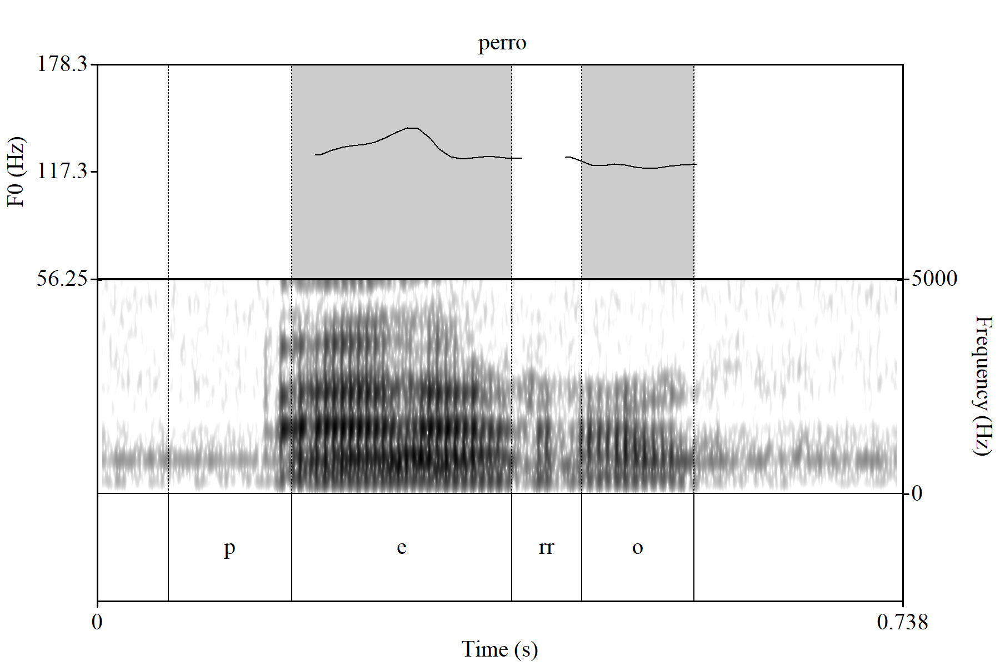
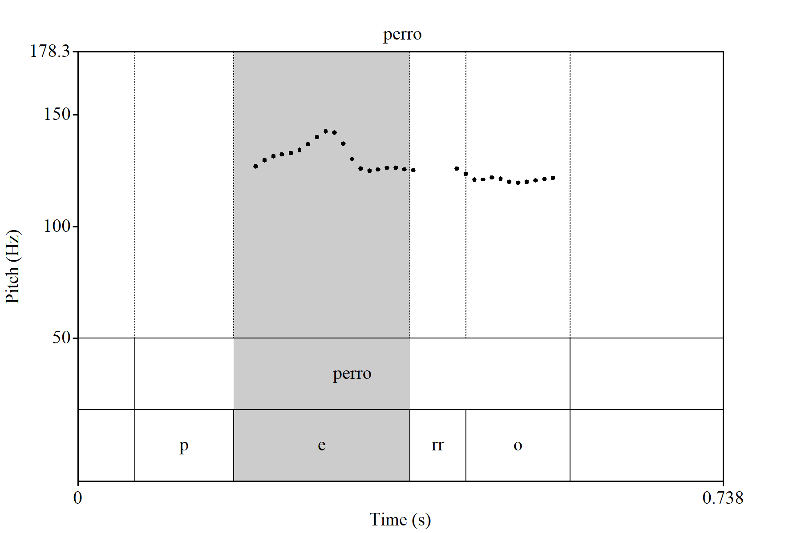

.. TextGrid PicMaker documentation master file, created by
   sphinx-quickstart on Wed Oct  5 15:40:28 2022.
   You can adapt this file completely to your liking, but it should at least
   contain the root `toctree` directive.

Welcome to TextGrid PicMaker's documentation!
=============================================

`TextGrid PicMaker` is a Praat plug-in designed to create some default pictures
that combines ``Spectrogram`` and/or ``Pitch`` objects along with ``TextGrid``.

This plug-in also comes with some selecting-viewport mechanisms that will save
you time when creating a picture manually, especially when putting objects
together.

Examples
--------

Here are some examples you can create by default:

.. _spectrogram-perro.png:

   Spectrogram and TextGrid

.. _pitch_spectrogram-perro.png:

  Pitch, Spectrogram and TextGrid

.. _pitch-perro.png:

  Pitch and TextGrid

.. toctree::
   :maxdepth: 2
   :caption: Contents:

   installation
   quickstart
   commands

Indices and tables
==================

* :ref:`genindex`
* :ref:`modindex`
* :ref:`search`
