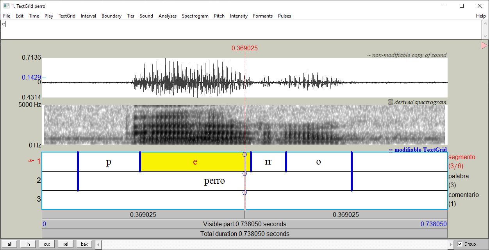
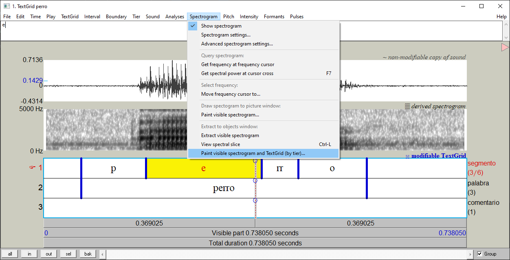
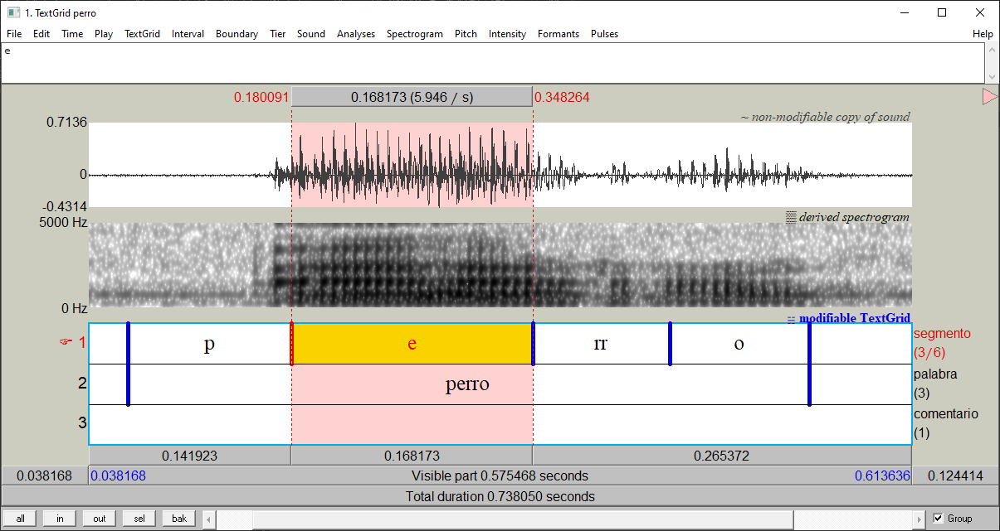
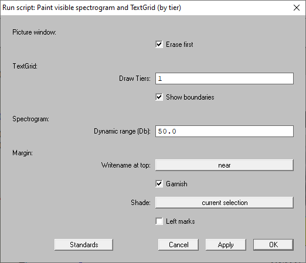
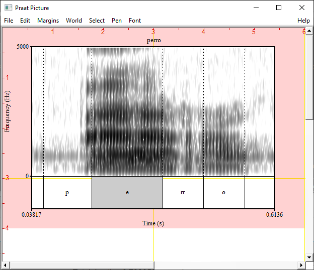
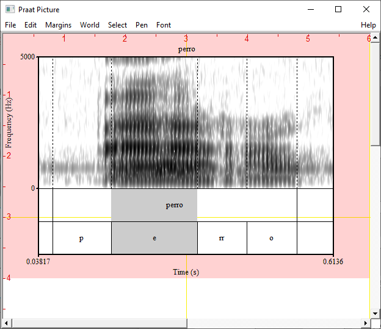
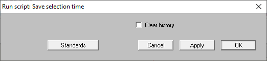
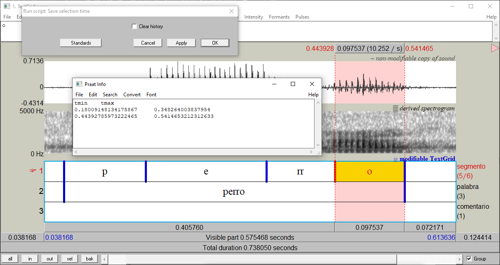
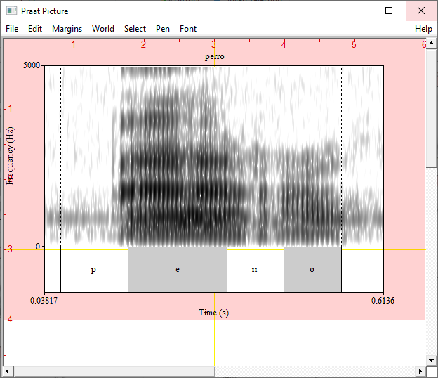

==========
Quickstart
==========

Creating pictures from the TextGridEditor window
================================================

A good point to start is the TextGridEditor (:numref:`textgrid_editor-window`),
the window we usually use when working with sounds and annotations.

.. _textgrid_editor-window:

   The TextGridEditor window

Activate the plug-in commands
-----------------------------

The plug-in comes with a set of commands that can be found in the TextGridEditor
menu. These commands are deactivated by default. To activate them, go to the
plug-in menu in the `Objects window` (``Praat > Goodies > TGDraw``)
and click on the command ``TextGridEditor preferences``. In the dialogue
box, check the button ``Show commands in TextGridEditor`` and press `Ok`, then
restart Praat. Once this is done, open a Sound and its TextGrid in the
TextGridEditor. Now, when you navigate on the Pitch and Spectrogram menus, you
will see that there are some new items at the end of each menu list
(see :numref:`textgrid_editor-window2`).

.. _textgrid_editor-window2:

   The Spectrogram menu

These are the commands added:

* Spectrogram menu

  * ``Paint visible Spectrogram and TextGrid (by tier)...``

* Pitch menu

  * ``Draw visible pitch contour and TextGrid (by tier)...``

  * ``Draw visible pitch intonation (by tier)...``

* Time menu

  * ``Save selection time...``

.. warning:: The commands added to the TextGridEditor cause that Praat raises
   a warning message when you open a TextGrid alone. This can be annoying. You
   can avoid this behavior by using the button ``View & Edit alone (no warn)``.
   This button is automatically added when you install the plug-in.

   .. figure:: img/view_and_edit_alone.png
      :align: center

      Open a TextGrid without warning messages

   You can also deactivate the TextGridEditor commands.

Picture a Spectrogram and TextGrid
----------------------------------

For this example, open a Sound and its TextGrid object in the TextGridEditor as
in :numref:`textgrid_editor-selection`.

.. _textgrid_editor-selection:

  Selection in the TextGridEditor

Note that in the figure, the current view is set to match the transcribed word.
I have also selected the portion of time correponding to the vowel ``e``.

Go to the ``Spectrogram`` menu and click on the command
``Paint visible spectrogram and TextGrid (by tier)...``. A dialogue box similar
to the :numref:`dialogue_box-spectrogram&textgrid` will appear. Leave the
default options and click on `Ok`.

.. _dialogue_box-spectrogram&textgrid:

  Dialogue box 

You will get a picture as in :numref:`paint_perro`.

.. _paint_perro:

  Resulting picture 

As you can see, the plug-in captures the current view of the TextGridEditor and
put it into the Praat Picture window. Here, the spectrogram and the first tier
of the TextGrid are shown. The selection we did is also hightlighted.

We can tweak our picture by changing some of the values in the dialogue box.
For example, if we want to that our picture includes the second and first tier
of the TextGrid, in that order, we can set the ``Draw tiers`` field to ``2, 1``.
This will print the :numref:`paint_perro2`.

.. _paint_perro2:

  Printing the tier 2 and 1 (in that order)

We can shade multiple selections in our picture. To do that, we use the command
in the Time menu, ``Time > Save selection time...``. When you open it, the
dialogue in :numref:`save_time1` will pop up.

.. _save_time1:

  The ``Save selection time...`` dialogue box

The mechanism is simple: for each time you select an interval, click on the
`Apply` button of the dialogue box. Repeat this process as many times as needed.
When you add a selection, it will be printed in the Info window. In the
:numref:`save_time2`, I have added the intervals corresponding to the vowels
``e`` and ``o``.

.. _save_time2:

  The ``Save selection time...`` dialogue box

When you are done, close the dialogue and return to the
``Paint visible spectrogram and TextGrid (by tier)...`` command. Now, focus on
the ``Shade`` field and pick the option ``buffer``, then click on `Ok`. You
will get a picture as in :numref:`paint_perro3`.

.. _paint_perro3:

  Resulting picture 

Picture Pitch and TextGrid
--------------------------

Creating a picture that includes Pitch and TextGrid is easy. First, make sure
that the pitch is visible in the spectrogram, and then go to
``Draw visible pitch contour and TextGrid (by tier)...``.

Picture Pitch, Spectrogram and TextGrid
---------------------------------------

pass